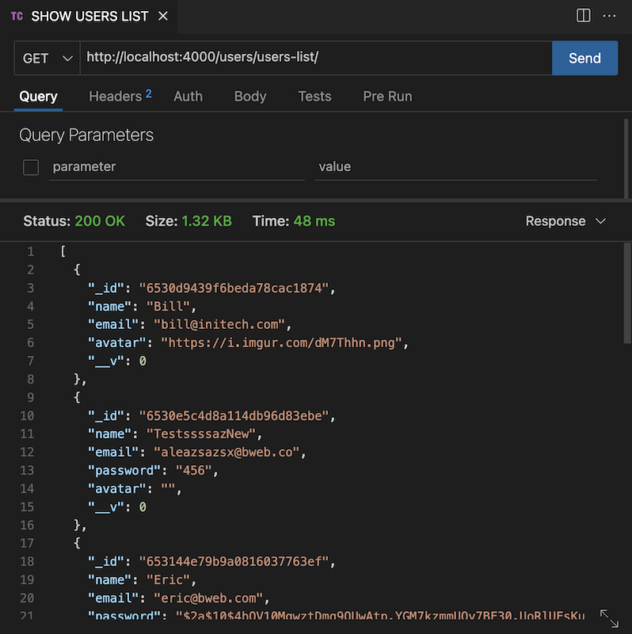
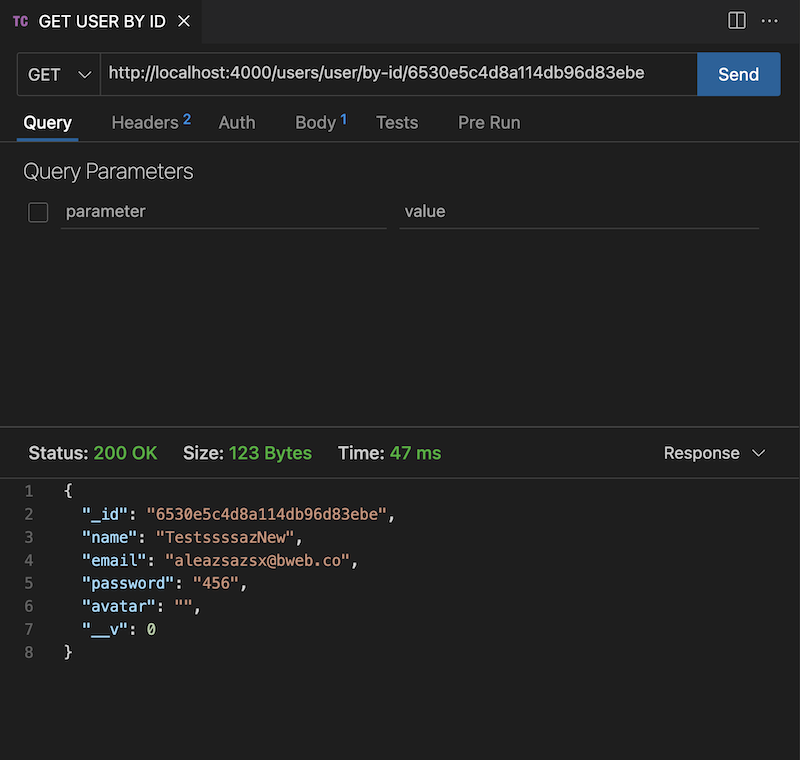
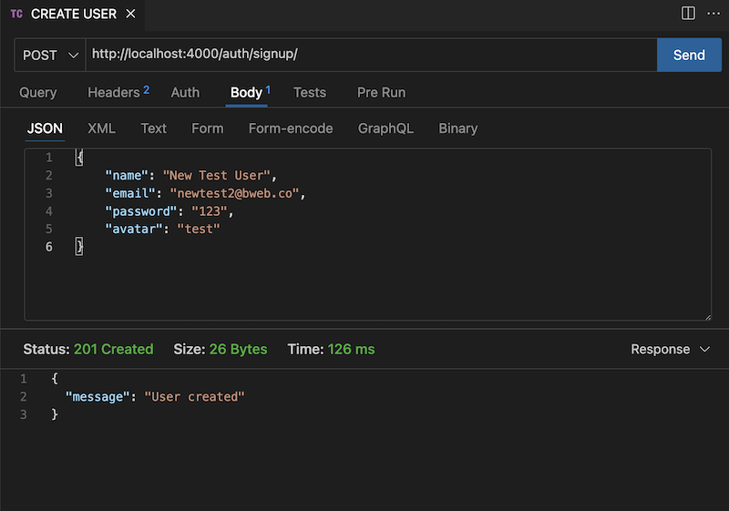
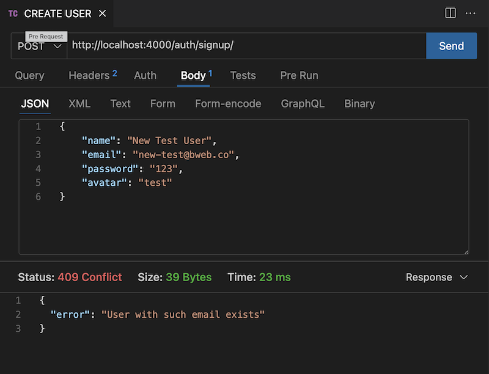
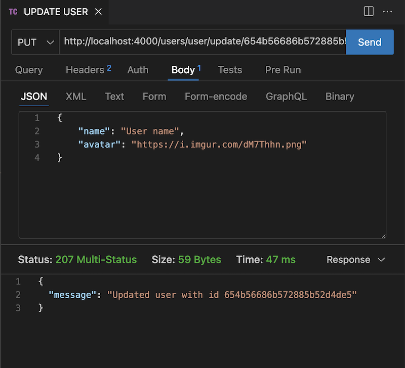
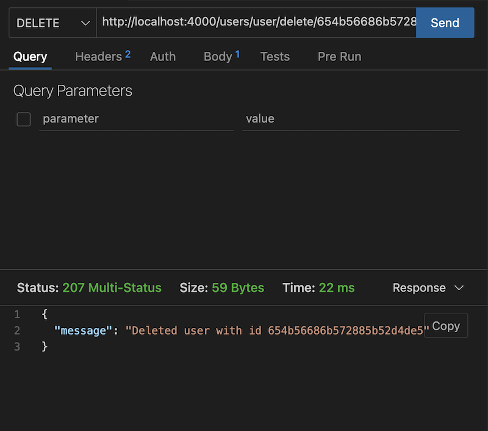

# Le projet pédagogique: découverte du MongoDB

Le principal but de ce projet et de faire un API en Node.js à l'aide de TypeScript et de faire des requètes sur MongoDB.

Dans ce projet j'utilise la base de données des utilisateurs.
## Installation

Pour installer le projet il faut : 
- installer toutes les dependances à la racine du projet

```bash
    npm install
```
- ajouter le fichier .env à la racine du projet
- ajouter là toutes les données avec une connexion à MongoDB
- démarrer le serveur
```bash
    npm run dev
```
## Référence API

#### Récupérer tous les utilisateurs

```http
  GET /users/users-list
```

#### Récupérer un utilisateur par id

```http
  GET /users/user/by-id/${id}
```

| Parameter | Type     | Description                       |
| :-------- | :------- | :-------------------------------- |
| `id`      | `string` | **Required**. Id d'utilisateur |

#### Récupérer un utilisateur par email

```http
  GET /users/user/by-email/
```

| Parameter | Type     | Description                       |
| :-------- | :------- | :-------------------------------- |
| `email`      | `string` | **Required**. Email d'utilisateur |

Il faut ajouter email dans le body de requête :

```js
    {
        "email": "test@test.com"
    }
```

#### Créer un utilisateur

```http
  POST /auth/signup
```

| Parameter | Type     | Description                       |
| :-------- | :------- | :-------------------------------- |
| `name`      | `string` | **Required**. Prénom d'utilisateur |
| `email`      | `string` | **Required**. Email d'utilisateur |
| `password`      | `string` | **Required**. Password d'utilisateur |
| `avatar`      | `string` | Avatar d'utilisateur |

Il faut ajouter tous les parametres dans le body de requête :

```js
    {
        "name": "Prénom",
        "email": "test@test.com",
        "password": "12345"
        "avatar": "https://icon-library.com/images/avatar-icon-images/avatar-icon-images-4.jpg"
    }
```

#### Modifier un utilisateur

```http
  PUT /users/user/update/${id}
```

| Parameter | Type     | Description                       |
| :-------- | :------- | :-------------------------------- |
| `id`      | `string` | **Required**. Id d'utilisateur |
| `name`      | `string` | **Required**. Prénom d'utilisateur |
| `email`      | `string` | **Required**. Email d'utilisateur |
| `password`      | `string` | **Required**. Password d'utilisateur |
| `avatar`      | `string` | Avatar d'utilisateur |

Il faut ajouter tous les parametres (sauf id) dans le body de requête :

```js
    {
        "name": "Prénom",
        "email": "test@test.com",
        "password": "12345"
        "avatar": "https://icon-library.com/images/avatar-icon-images/avatar-icon-images-4.jpg"
    }
```

#### Supprimer un utilisateur

```http
  DELETE /users/user/delete/${id}
```

| Parameter | Type     | Description                       |
| :-------- | :------- | :-------------------------------- |
| `id`      | `string` | **Required**. Id d'utilisateur |


## La stack technique

**Serveur :** Node.js

**Framework :** Express.js

**Languages :** JavaScript, TypeScript

**Librairie :** Mongoose

## Screenshots

### --------------------- Get all users ---------------------

### --------------------- Get user by id ---------------------

### --------------------- Create user ---------------------

### --------------------- Create user error ---------------------

### --------------------- Update user ---------------------

### --------------------- Delete user ---------------------
